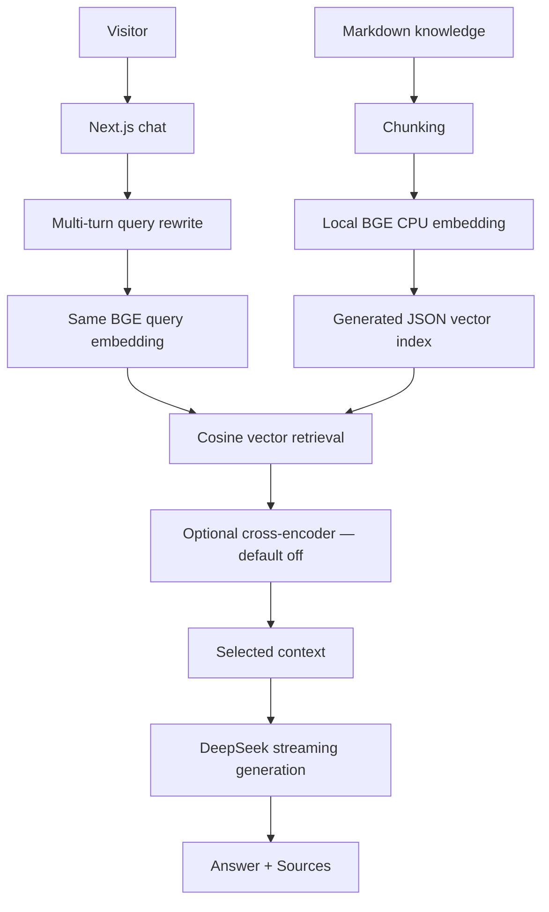

# Personal AI Career Agent

A source-grounded personal AI agent built with local RAG, BGE embeddings, DeepSeek streaming, retrieval evaluation, and optional cross-encoder reranking.

与静态个人主页不同，访客可以询问候选人的项目、技能与求职方向。系统从结构化知识库检索证据，流式回答并显示来源。公开版本使用完全虚构的 Alex Chen 示例资料。

## Architecture



BGE handles Embedding / Retrieval; DeepSeek handles query rewrite and Answer Generation. The OpenAI npm package is a compatible SDK client; generation requests target https://api.deepseek.com, using deepseek-flash. There is no OpenAI embedding service or DeepSeek embedding endpoint.

## Features

- Local CPU BAAI/bge-small-zh-v1.5: pinned ONNX export, 512 dimensions, CLS pooling, normalized vectors, cached model instance.
- Small-scale RAG with section/source metadata and completion-time Sources.
- Streaming chat, bounded retry, Stop/Abort and multi-turn query rewrite.
- Graded retrieval metrics, candidate recall, BM25 / Hybrid RRF and reranker experiments.
- Optional BAAI/bge-reranker-base CPU Q8; RERANKER_ENABLED=false by default.
- Persistent Node / Docker runtime, model integrity verification, rate and concurrency protection.

## Quick Start

Use Node **24.19+** and pnpm **11.19.0**. Initial model preparation needs access to Hugging Face; inference then runs locally. Allow at least 2 GiB RAM for the small-scale runtime.

```bash
git clone <your-repository-url>
cd <repository-directory>
corepack enable
corepack prepare pnpm@11.19.0 --activate
pnpm install --frozen-lockfile
cp .env.example .env.local
```

PowerShell: use `Copy-Item .env.example .env.local` instead of cp. Do not overwrite an existing private environment file.

Acquire a key from the [DeepSeek platform](https://platform.deepseek.com/) and edit .env.local:

```env
DEEPSEEK_API_KEY=your_key_here
KNOWLEDGE_DIR=knowledge/example
RERANKER_ENABLED=false
RAG_DEBUG=false
```

The key stays server-side. No key is required for model preparation, ingestion, local retrieval or offline tests. Chat generation and follow-up rewriting send only the required retrieved context/history to DeepSeek.

```bash
pnpm model:prepare
pnpm model:verify
pnpm ingest
pnpm check:rag
pnpm dev
```

Open http://localhost:3000. Change the display identity in config/profile.ts when adapting the project. Sources and LLM outputs still require human review.

### Private knowledge

Copy the six knowledge/example/*.md files into knowledge/local/, replace their fictional content and set KNOWLEDGE_DIR=knowledge/local in .env.local. Run pnpm ingest again. The index fingerprint detects stale knowledge. knowledge/local/, knowledge/private/, legacy root knowledge files and all data indexes are ignored.

data/embeddings.json is a **Generated Artifact**, containing chunk text as well as vectors. It must not be committed. Keep knowledge and its matching index together when deploying a private instance. The public Dockerfile deliberately builds the fictional example, not local private data.

### Checks and evaluation

```bash
pnpm test
pnpm typecheck
pnpm lint
pnpm build
pnpm eval:rag
pnpm eval:compare
pnpm eval:candidate-recall
```

The default test suite uses synthetic fixtures and no DeepSeek key or model downloads. Two real BGE/index integration tests are opt-in after model preparation and ingestion: set RUN_MODEL_TESTS=true and run pnpm test. In PowerShell: `$env:RUN_MODEL_TESTS='true'; pnpm test`.

Optional experiments: pnpm eval:reranker and pnpm eval:reranker-pareto. These prepare the existing pinned cross-encoder on first use; its download is larger and CPU latency is higher. All public evaluation commands use eval/public/example-rag-eval.json and save generated outputs under ignored .cache/evaluation/. They do not reproduce private historical scores. Negative questions are excluded from positive retrieval metrics; reliable unknown rejection is not implemented.

### Docker

```bash
docker build -t personal-career-agent:example .
docker run --rm -p 127.0.0.1:3000:3000 --env-file .env.local -e KNOWLEDGE_DIR=knowledge/example personal-career-agent:example
```

The image prepares the pinned model and generates the example index during build. Never bake .env.local or API keys into images. The Docker context excludes private knowledge, indexes, logs and research traces. For a local production build: pnpm build, then node scripts/prepare-native-runtime.mjs, then pnpm start (after preparing model and index). A public deployment requires additional private access, HTTPS, trusted ingress IP validation, resource/cost limits and rollback checks; none is claimed here.

## Evaluation & Iteration

Vector baseline → BM25 / Hybrid → Knowledge Audit → Graded Relevance → Candidate Recall → Reranker → Candidate-N Pareto → Real E2E.

Historical anonymous engineering comparisons:

| Stage | Metric | Result |
|---|---|---:|
| Vector | Primary Hit@1 | 52% |
| Vector | Primary MRR@5 | 0.588 |
| Candidate generation | Primary Recall@20 | 95.45% |
| Top-20 reranker | Primary Hit@1 | 64% |
| Top-20 reranker | Primary MRR@5 | 0.708 |
| Top-20 reranker | Relevant Hit@5 | 100% |

Metrics are based on a small manually labeled project-specific benchmark and are intended for engineering comparison, not general model benchmarking. Hit/MRR used 25 positive questions; candidate Primary Recall used 22 with nonempty primary labels. Private datasets and trace contents are intentionally excluded, so these historical numbers are not independently reproducible from the fictional demo.

See [retrieval benchmark](eval/public/retrieval-benchmark.md), [reranker experiment](eval/public/reranker-experiment.md) and [system evaluation](eval/public/system-evaluation.md).

## Engineering Decisions

- **Local BGE:** avoids an embedding API dependency; CPU/memory and model preparation costs remain.
- **JSON instead of a vector database:** dozens of chunks fit a simple cosine search. This is not a production-scale claim.
- **Reranker off by default:** offline ranking improved, but real E2E latency increased without enough demonstrated user-facing benefit. It remains experimental.
- **Persistent Node / Docker:** provides the native ONNX CPU runtime and cached model lifecycle.
- **Independent evidence labels:** distinguish sufficient Primary evidence from partial Supporting evidence; keyword overlap alone is not relevance.

## Project Structure

```text
app/                  Pages and chat/health API
components/           Streaming chat and Sources
config/               Display identity
lib/ai/               DeepSeek, prompt and stream reliability
lib/rag/              Embedding, retrieval and optional experiments
knowledge/example/    Fictional Markdown knowledge
scripts/              Preparation, ingestion and public evaluation
tests/                Synthetic fixtures and offline tests
eval/public/          Demo labels and anonymous summaries
models/.../manifest.json  Fixed model revision / checksums
```

## Security, Privacy & Limitations

Keep private knowledge and .env.local outside version control. Generated indexes also contain personal text. Do not force-add ignored files, publish raw traces or put private files in public/. Use pnpm release:audit and pnpm release:export before the first commit; review the sanitized export, not the entire working directory.

Rate/concurrency protections are in-memory and single-process; they reset on restart. TRUST_PROXY defaults to false and uses a shared rate bucket. Enable trusted client IP only behind an authenticated ingress that overwrites forwarding headers and blocks direct access. No public deployment or high-concurrency proof is included.

This portfolio / educational application is not an identity verification system. Retrieved sources reduce unsupported claims but LLM outputs can still be incomplete or incorrect. Roadmap: better unknown rejection, broader retrieval validation and audited deployment templates.

## Third-Party Models & License

Project source: [MIT](LICENSE). Models belong to their respective publishers: [BAAI/bge-small-zh-v1.5](https://huggingface.co/BAAI/bge-small-zh-v1.5), [BAAI/bge-reranker-base](https://huggingface.co/BAAI/bge-reranker-base), with ONNX exports by onnx-community / Xenova. DeepSeek is a separately billed API service. See [third-party notices](THIRD_PARTY_NOTICES.md); the project license does not replace third-party licenses or API terms.
